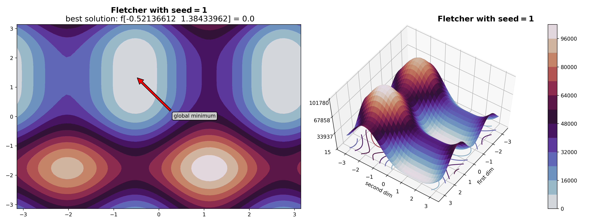
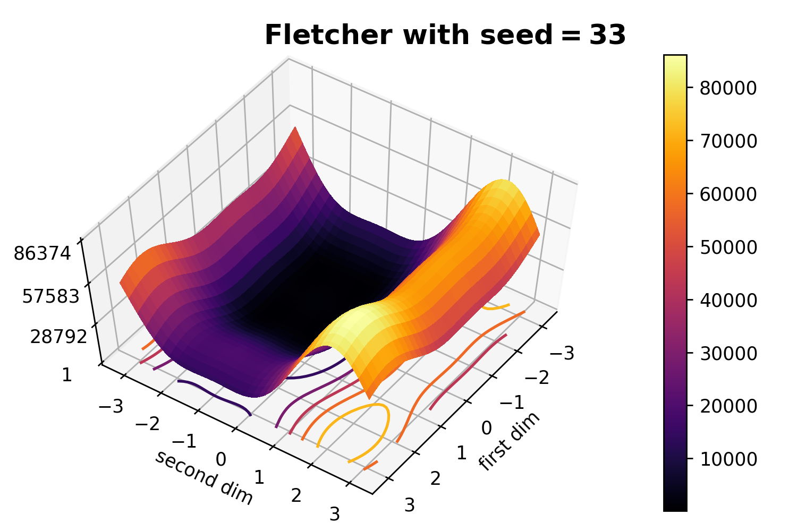

# Optimization Test Functions

[](https://pypi.org/project/OptimizationTestFunctions/)
[](https://pepy.tech/project/optimizationtestfunctions)
[](https://pepy.tech/project/optimizationtestfunctions)
[](https://pepy.tech/project/optimizationtestfunctions)

Collection of optimization test functions and some useful methods for working with them

```
pip install OptimizationTestFunctions
```

- [Optimization Test Functions](#optimization-test-functions)
  - [Test function object](#test-function-object)
  - [Available test functions](#available-test-functions)
    - [Sphere](#sphere)
    - [Ackley](#ackley)
    - [AckleyTest](#ackleytest)
    - [Rosenbrock](#rosenbrock)
    - [Fletcher](#fletcher)
    - [Griewank](#griewank)
    - [Penalty2](#penalty2)
    - [Quartic](#quartic)
    - [Rastrigin](#rastrigin)
    - [SchwefelDouble](#schwefeldouble)
    - [SchwefelMax](#schwefelmax)
    - [SchwefelAbs](#schwefelabs)
    - [SchwefelSin](#schwefelsin)
    - [Stairs](#stairs)
    - [Abs](#abs)
    - [Michalewicz](#michalewicz)
    - [Scheffer](#scheffer)
    - [Eggholder](#eggholder)
    - [Weierstrass](#weierstrass)
  - [Plotting tools](#plotting-tools)
    - [Structure](#structure)
    - [How to use](#how-to-use)
  - [Transformation tools](#transformation-tools)
    - [Structure](#structure-1)
    - [How to use](#how-to-use-1)

## Test function object

Each test function is the **callable object** of some class with next fields at least:

* `bounds` -- tuple with structure `(xmin, xmax, ymin, ymax)`. It is recommended borders for 3D plotting and 2D optimization for this function
* `x_best` -- global minimum argument of function in `bounds` area as numpy array. If unknown, it's `None`
* `f_best` -- function value at `x_best` if `x_best` exists and `None` otherwise

A lot of function objects need determined `dim` argument in constructor.

U can call these "functions" like usual functions with structure `numpy 1D-array -> float value`.

## Available test functions

Checklist:

* `Sphere(dim, degree = 2)`
* `Ackley(dim)`
* `AckleyTest(dim)`
* `Rosenbrock(dim)`
* `Fletcher(dim, seed = None)`
* `Griewank(dim)`
* `Penalty2(dim, a=5, k=100, m=4)`
* `Quartic(dim)`
* `Rastrigin(dim)`
* `SchwefelDouble(dim)`
* `SchwefelMax(dim)`
* `SchwefelAbs(dim)`
* `SchwefelSin(dim)`
* `Stairs(dim)`
* `Abs(dim)`
* `Michalewicz(m = 10)`
* `Scheffer(dim)`
* `Eggholder(dim)`
* `Weierstrass(dim, a = 0.5, b = 3, kmax = 20)`

U imports them using code:
```python
from OptimizationTestFunctions import Sphere, Ackley, AckleyTest, Rosenbrock, Fletcher, Griewank, Penalty2, Quartic, Rastrigin, SchwefelDouble, SchwefelMax, SchwefelAbs, SchwefelSin, Stairs, Abs, Michalewicz, Scheffer, Eggholder, Weierstrass
```

And plot them using [code](tests/heatmap_test.py)


### Sphere

### Ackley

### AckleyTest

### Rosenbrock

### Fletcher

### Griewank

### Penalty2

### Quartic

### Rastrigin

### SchwefelDouble

### SchwefelMax

### SchwefelAbs

### SchwefelSin

### Stairs

### Abs

### Michalewicz

### Scheffer

### Eggholder

### Weierstrass


## Plotting tools

### Structure

There are `plot_3d` function for 3D-plotting:
```python
plot_3d(func, points_by_dim = 50, title = '', bounds = None, show_best_if_exists = True, save_as = None, cmap = 'twilight', plot_surface = True, plot_heatmap = True)
```
with arguments:
    
* `func` : **class callable object**;
        Object which can be called as function.
* `points_by_dim` : **int**, optional;
        points for each dimension of plotting (50x50, 100x100...). The default is 50.
* `title` : **str**, optional;
        title of plot with LaTeX notation. The default is ''.
* `bounds` : **tuple**, optional;
        space bounds with structure `(xmin, xmax, ymin, ymax)`. The default is None.
* `show_best_if_exists` : **boolean**, optional;
        point best solution by arrow if x_best exists. The default is True.
* `save_as` : **str/None**, optional;
        file path to save image (None if not needed). The default is None.
* `cmap` : **str**, optional;
        color map of plot. The default is `'twilight'`. See another cmaps examples [here](https://github.com/PasaOpasen/Wave-animation-from-svd#heatmaps)
* `plot_surface` : **boolean**, optional;
        plot 3D surface. The default is True.
* `plot_heatmap` : **boolean**, optional;
        plot 2D heatmap. The default is True.

### How to use

```python
from OptimizationTestFunctions import Fletcher, plot_3d

# dim should be 2 for plotting 3D
dim = 2

# Fletcher is good function depends on random seed!

seed = 1
f1 = Fletcher(dim, seed)

# full available functional of plotting

plot_3d(f1, 
        points_by_dim = 70, 
        title = fr"{type(f1).__name__}\ with\ seed = {seed}", # LaTeX formula notation
        bounds = None, 
        show_best_if_exists = True, 
        save_as = "Fletcher1.png",
        cmap = 'twilight',
        plot_surface = True,
        plot_heatmap = True)
```


```python
# disable arrow

plot_3d(f1, 
        points_by_dim = 70, 
        title = fr"{type(f1).__name__}\ with\ seed = {seed}",
        bounds = None, 
        show_best_if_exists = False, 
        save_as = "Fletcher2.png",
        cmap = 'twilight',
        plot_surface = True,
        plot_heatmap = True)
```


```python
# select another bounds

plot_3d(f1, 
        points_by_dim = 70, 
        title = fr"{type(f1).__name__}\ with\ seed = {seed}",
        bounds = (-2, 6, -8, 10), 
        show_best_if_exists = False, 
        save_as = "Fletcher3.png",
        cmap = 'twilight',
        plot_surface = True,
        plot_heatmap = True)
```


```python
# Create another Fletcher function

seed = 33

f2 = Fletcher(dim, seed)

# use another cmap

plot_3d(f2, 
        points_by_dim = 70, 
        title = fr"{type(f1).__name__}\ with\ seed = {seed}",
        bounds = None, 
        show_best_if_exists = False, 
        save_as = "Fletcher4.png",
        cmap = 'inferno',
        plot_surface = True,
        plot_heatmap = True)
```


```python
# plot only 3D

plot_3d(f2, 
        points_by_dim = 70, 
        title = fr"{type(f1).__name__}\ with\ seed = {seed}",
        bounds = None, 
        show_best_if_exists = False, 
        save_as = "Fletcher5.png",
        cmap = 'inferno',
        plot_surface = True,
        plot_heatmap = False)
```


```python
# plot only heatmap

plot_3d(f2, 
        points_by_dim = 70, 
        title = fr"{type(f1).__name__}\ with\ seed = {seed}",
        bounds = None, 
        show_best_if_exists = True, 
        save_as = "Fletcher6.png",
        cmap = 'inferno',
        plot_surface = False,
        plot_heatmap = True)
```


## Transformation tools

### Structure

`Transformation` object is the callable object like "functions" of this package. It performs next useful transformations:

* parallel transfer (*shift*)
* rotation
* add noises

U can create `Transformation` object using code:

```python
transform = Transformation(transformed_function, shift_step = None, rotation_matrix = None, noise_generator = None, seed = None)
```

where:

* `transformed_function` : **function or class callable object**;
            transformed function.
* `shift_step` : **numpy 1D array/None**, optional;
            array of shifts by each dimension or `None`. The default is `None`.
* `rotation_matrix` : **2D-array/int/None**, optional;
            2D ortogonal rotation matrix or dimension for creating random rotation matrix or `None` if no rotate. The default is `None`.
* `noise_generator` : **function**, optional;
            function gets current value and returns value with some noise. The default is `None`.
* `seed` : **int**, optional;
            random seed for rotation matrix if needed reproduce. The default is `None`.

U also can create noises by using `Noises` static class.

### How to use

```python
import numpy as np

from OptimizationTestFunctions import Weierstrass, plot_3d, Transformation, Noises

# dim should be 2 for plotting 3D
dim = 2

# Let's create Weierstrass function

f = Weierstrass(dim, a = 0.5, b = 5, kmax = 20)

# show it

plot_3d(f, 
        points_by_dim = 70, 
        title = f"{type(f).__name__}",
        bounds = None, 
        show_best_if_exists = True, 
        save_as = "Trans1.png",
        cmap = 'hot',
        plot_surface = True,
        plot_heatmap = True)
```


```python
# transformation with shift

shifted_func = Transformation(f, shift_step=np.array([3, 4]))

# show it

plot_3d(shifted_func, 
        points_by_dim = 70, 
        title = "shifted",
        bounds = None, 
        show_best_if_exists = True, 
        save_as = "Trans2.png",
        cmap = 'hot',
        plot_surface = True,
        plot_heatmap = True)
```


```python
# transformation with rotation

rotated_func = Transformation(f, rotation_matrix = dim, seed = 2) # random rotation matrix with dim 2

# show it

plot_3d(rotated_func, 
        points_by_dim = 70, 
        title = "rotated",
        bounds = None, 
        show_best_if_exists = True, 
        save_as = "Trans3.png",
        cmap = 'hot',
        plot_surface = True,
        plot_heatmap = True)
```


```python
# transformation with noise

noised_func = Transformation(f, noise_generator = Noises.normal(center = 0, sd = 0.5)) 

# show it

plot_3d(noised_func, 
        points_by_dim = 70, 
        title = "noised",
        bounds = None, 
        show_best_if_exists = True, 
        save_as = "Trans4.png",
        cmap = 'hot',
        plot_surface = True,
        plot_heatmap = True)
```


```python
# U can specify your noise behavior

def add_noise(current_val):
    if current_val > 5:
        return 0
    
    return current_val + np.random.random()/10

noised_func = Transformation(f, noise_generator = add_noise) 

plot_3d(noised_func, 
        points_by_dim = 70, 
        title = "noised",
        bounds = None, 
        show_best_if_exists = True, 
        save_as = "Trans5.png",
        cmap = 'hot',
        plot_surface = True,
        plot_heatmap = True)
```


```python
# Also u can combine all these transformations 

new_func = Transformation(f,
                          shift_step= np.array([10, -10]),
                          rotation_matrix = 2, seed = 3,
                          noise_generator = Noises.uniform(-0.1, 0.5)
                          ) 

plot_3d(new_func, 
        points_by_dim = 70, 
        title = "mixed",
        bounds = None, 
        show_best_if_exists = True, 
        save_as = "Trans6.png",
        cmap = 'hot',
        plot_surface = True,
        plot_heatmap = True)
```

